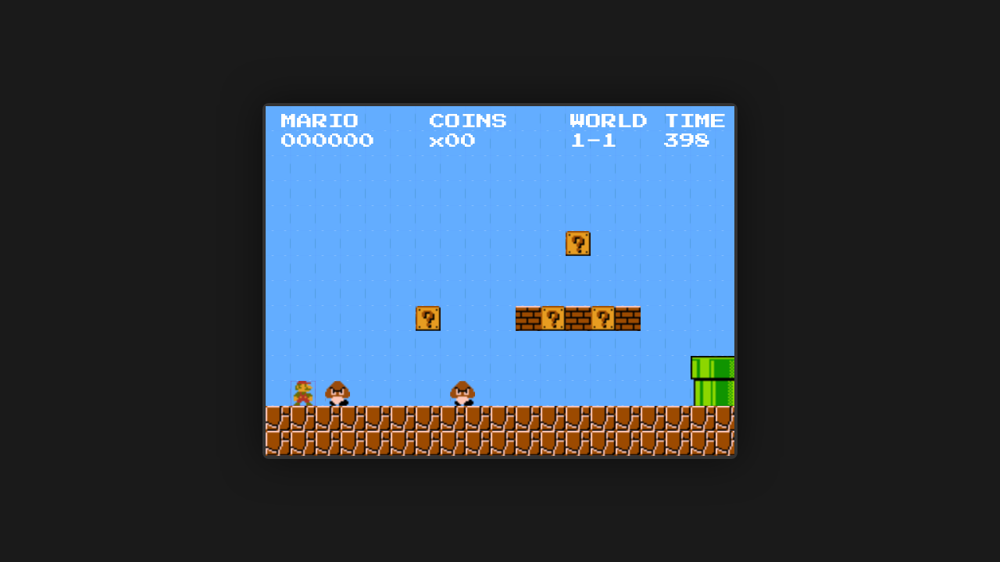

# Super Mario Bros (JavaScript)

A classic Super Mario Bros recreation built with JavaScript and the HTML5 Canvas API.


## Preview



## Features

- Classic Super Mario Bros gameplay mechanics
- Smooth physics-based movement and collision detection
- Entity Component System (ECS) architecture
- Responsive canvas rendering
- Keyboard controls

## Tech Stack

- **Vanilla JavaScript** - Core game logic
- **HTML5 Canvas** - Rendering
- **Vite** - Build tooling and development server

## Getting Started

### Prerequisites

- Node.js (v16 or higher recommended)
- npm

### Installation

```bash
# Clone the repository
git clone https://github.com/your-username/js-supermariobros.git

# Navigate to project directory
cd js-supermariobros

# Install dependencies
npm install
```

### Development

```bash
# Start the development server with hot reload
npm run dev
```

Open your browser and navigate to `http://localhost:5173` (or the port shown in your terminal).

### Build

```bash
# Build for production
npm run build

# Preview production build
npm run preview
```

## Controls

| Key | Action |
|-----|--------|
| Arrow Keys / WASD | Move Left/Right |
| Space / Up Arrow | Jump |

## Project Structure

```
js-supermariobros/
├── src/
│   ├── main.js          # Application entry point
│   ├── core/            # Core game systems
│   └── ecs/             # Entity Component System implementation
├── public/
│   ├── assets/          # Game assets (sprites, sounds)
│   └── fonts/           # Custom fonts
├── tests/               # Test files
├── index.html           # HTML entry point
├── package.json         # Project configuration
└── vite.config.js       # Vite configuration
```

## Deployment

This project is configured for deployment on GitHub Pages.

### GitHub Pages Setup

1. Go to your GitHub repository **Settings > Pages**
2. Set **Source** to **GitHub Actions**
3. Push to `main` or `master` branch (or run the workflow manually)

The Vite `base` path is automatically configured during GitHub Actions builds.

### Manual Deployment

```bash
npm run build
# Deploy the contents of the dist/ directory to your hosting service
```

## Testing

```bash
# Run tests
npm test
```

## License

This project is licensed under the MIT License.

## Acknowledgments

- Super Mario Bros is a trademark of Nintendo. This project is a fan-made recreation for educational purposes.
